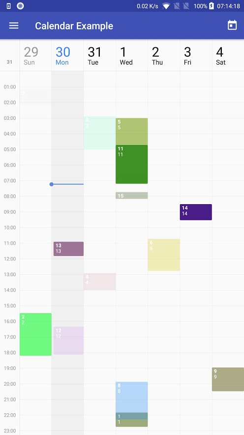
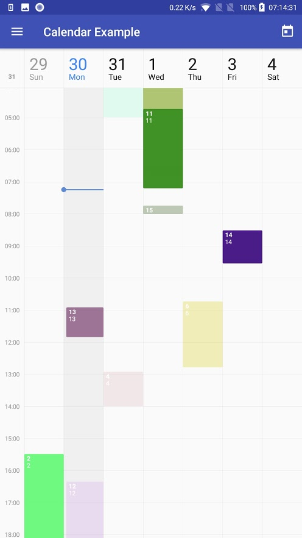

# CalendarView

[](https://github.com/JonasWanke/com.jonaswanke.calendar/releases)
[](https://bintray.com/jonaswanke/maven/calendar)

[](http://www.apache.org/licenses/LICENSE-2.0)
[](https://github.com/Naereen/badges)


This library provides a Material Design CalendarView for Android (week view; more coming soon!). The default style is copied from the Google Calendar app, but almost everything is customizable.

| Screenshot of the [example app][example] | Zoomed in                                 |
| :--------------------------------------: | :---------------------------------------: |
|      |  |


- [CalendarView](#calendarview)
  - [Usage](#usage)
  - [Sample](#sample)
  - [Customization](#customization)
  - [Changelog](#changelog)


## Usage

1. Import the library

  ```groovy
  implementation 'com.jonaswanke.calendar:calendar:0.0.4'
  ```

2. Add CalendarView in you layout

  ```xml
  <com.jonaswanke.calendar.CalendarView
      android:id="@+id/calendar"
      android:layout_width="match_parent"
      android:layout_height="match_parent" />
  ```

3. Provide events to the view

  ```kotlin
  calendar.eventRequestCallback = { week ->
      // retrieve events synchronously or asynchronously
      launch(UI) {
          val events: List<Event> = // ...
          calendar.setEventsForWeek(week, events)
      }
  }
  ```

  You can call CalendarView.setEventsForWeek() anytime you want. The events will be cached and used when required. Old events for that week are overridden.

4. Add your listeners

  ```kotlin
  calendar.onEventClickListener = { event ->
      // event was clicked
      Toast.makeText(this, event.title + " clicked", Toast.LENGTH_LONG).show()
  }
  calendar.onEventLongClickListener = { event ->
      // event was long clicked
      Toast.makeText(this, event.title + " long clicked", Toast.LENGTH_LONG).show()
  }
  ```


## Sample

There is also a [sample app][example] to get you started.


## Customization

*Following soon...*


## Changelog

See [here][changelog] for the changelog.

[example]: ./example
[changelog]: ./CHANGELOG.md
