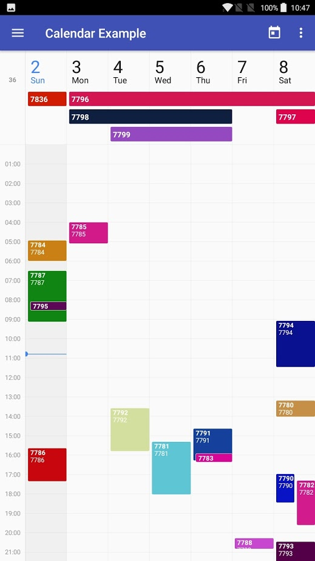
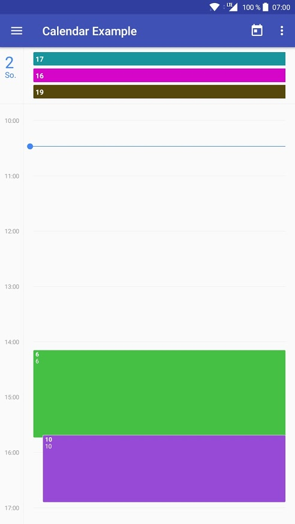
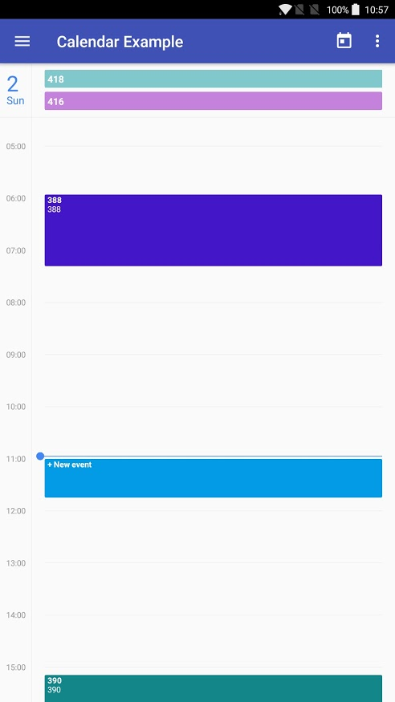

❌❌❌ No longer supported ❌❌❌

Unfortunately, I no longer have the time to continue developing this library and my focus has shifted. If you are switching to Flutter, you might be interested in my [<kbd>timetable</kbd>](https://pub.dev/packages/timetable) package as a replacement.

# CalendarView

[](https://travis-ci.com/JonasWanke/com.jonaswanke.calendar)
[](https://bintray.com/jonaswanke/maven/calendar)

[](http://www.apache.org/licenses/LICENSE-2.0)
[](https://semver.org/spec/v2.0.0.html)
[](https://github.com/Naereen/badges)


This library provides a Material Design CalendarView for Android (week and day view; more coming soon!). The default style is copied from the Google Calendar app, but almost everything is customizable.

| Screenshot of the [example app][example]  |                 Day view                 |       Add event by tapping empty space       |
| :---------------------------------------: | :--------------------------------------: | :------------------------------------------: |
|  |  |  |


- [CalendarView](#calendarview)
  - [Features](#features)
  - [Usage](#usage)
  - [Sample](#sample)
  - [Customization](#customization)
  - [Changelog](#changelog)

## Features

- Week and Day views
- Scroll and zoom
- All-day events (and events > 24h) shown at the top
- All colors and most spacings are [customizable](#customization)


## Usage

1. Add the library to your gradle script

  ```groovy
  implementation 'com.jonaswanke.calendar:calendar:0.1.1'
  ```

2. Add CalendarView in you layout

  ```xml
  <com.jonaswanke.calendar.CalendarView
      android:id="@+id/calendar"
      android:layout_width="match_parent"
      android:layout_height="match_parent"
      app:range="week" />
  ```

  Currently supported ranges are `week` and `day`. More coming soon!

3. Provide events to the view

  ```kotlin
  calendar.eventRequestCallback = { week ->
      // Retrieve events synchronously or asynchronously
      val events: List<Event> = // ...
      calendar.setEventsForWeek(week, events)
  }
  ```

  `CalendarView` currently caches two views for either side of the current view (e.g. two weeks to the left and two to the right) for smooth swiping. When a new view is loaded, `eventRequestCallback` will be called with the new week.  
  You should then supply events *starting* in that week by calling `calendar.setEventsForWeek()` (multi-day and multi-week events are always stored where they begin and will then be distributed to where they are required).

  You can call `calendar.setEventsForWeek()` anytime you want. The events will be cached and used when required. Old events starting in that week are overridden.

  Events implement the following properties:

  ```kotlin
  val title: String // Displayed in bold
  val description: String? // Optional; shown in a second line
  @get:ColorInt
  val color: Int? // Optional background color
  val start: Long // Start time
  val end: Long // End time
  val allDay: Boolean // Whether the event takes all day. If so, start and end are just used to determine the day
  ```

4. Add your listeners (optional)

  ```kotlin
  calendar.onEventClickListener = { event ->
      // Event was clicked
      Toast.makeText(this, "${event.title} clicked", Toast.LENGTH_LONG).show()
  }
  calendar.onEventLongClickListener = { event ->
      // Event was long clicked
      Toast.makeText(this, "${event.title} long clicked", Toast.LENGTH_LONG).show()
  }
  ```

  As shown in screenshot 3 (above), the user can add events by tapping empty space inside `CalendarView`. This only works when an `onAddEventListener` is set.

  ```kotlin
  calendar.onAddEventListener = { addEvent ->
      // User tried to create a new event. addEvent is an event with populated start and end.
      Toast.makeText(this, "Add event at ${start}", Toast.LENGTH_SHORT).show()
      // Return true to remove the placeholder
      true
  }
  ```


## Sample

There is also a [sample app][example] to get you started.


## Customization

*Following soon...*


## Changelog

See [here][changelog] for the changelog.

[example]: ./example
[changelog]: ./CHANGELOG.md
